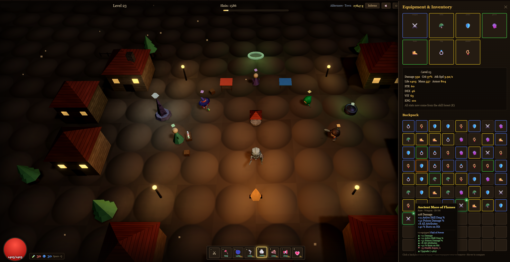

# Sanctuary's End

A fun, vibe-coded, browser-based action-RPG with serious Diablo vibes.

Sanctuary's End is a hack-and-slash ARPG built from a small set of plain static files — an HTML shell, the game script, and lazy-loaded 3D assets — rendered in 3D with Three.js. No build step, no install: roll a hero, dive an endless procedural dungeon, hunt loot, build out your skills, and clear bosses, all in your browser.



## Play it

**Online:** https://j3vb.github.io/Sanctuarys_End/sanctuary.html — just click and play.

**Locally:** the game now loads Three.js as ES modules, so it **must be served over `http://`** — double-clicking `sanctuary.html` (a `file://` URL) will no longer work (browsers block module loads from `file://`). Serve the repo with any static server and open the game over `http://localhost`.

Always use the **same fixed port** (`8000` below) every session. Browser saves (localStorage) are keyed per origin, so `localhost:8000` and `localhost:3000` are *different* save stores — switching ports hides your characters.

```
# from the repo root, pick ONE and stick with port 8000:
python -m http.server 8000
#   or
npx serve . -l 8000
```

Then open `http://localhost:8000/sanctuary.html`. WebGL support and (the first time) an internet connection for the CDN libraries are required.

> **Migrating an existing `file://` save?** Saves made by the old double-click build live in the `file://` origin and will *not* appear at `http://localhost:8000`. To carry them over: open your old `file://` build, go to **Settings → Saves → Download** (or **Copy**), then open the new `http://localhost:8000` build, paste/load the file under **Settings → Saves → Import & Reload**.

## Features

- Three classes — Warrior, Mage, and Rogue, each with their own skills and stat growth
- Active skills plus a passive skill forest of nodes, notables, and keystones
- Deep loot: five rarity tiers, affixes, enchanting, and gems across seven gear slots
- Towns and shops — vendors, a smith, alchemist, enchanter, gambler, and jeweler
- An endless procedural dungeon ("The Descent") with bosses every few floors
- An open world of biome-themed regions to explore and travel between
- Difficulty tiers from Normal all the way up to Inferno
- Auto-saving characters with multiple save slots (plus export/import for backups)
- Optional online co-op

## Co-op (optional)

For shared-world play, run the lightweight relay in `Server/server.js` (Node 16+):

```
cd Server
npm install
npm start
```

It defaults to port 8787 — start it, then connect from the in-game Multiplayer menu. Each player's game runs locally; the server just relays presence and chat.

Note: co-op uses a `ws://` (non-TLS) connection, so play from a locally-served `http://` page (see **Play it → Locally**) — browsers block `ws://` from the `https://` hosted page above, and the game can no longer be launched from `file://`. For best results each player serves their own local copy at `http://localhost:8000` (a secure context). For LAN/internet play, share the host's IP + port.

## Learn more

The full game codex lives in `sanctuary_wiki.html` — open it in your browser for searchable, detailed docs on classes, stats, combat formulas, status effects, items and affixes, uniques and sets, the economy, zones, difficulty scaling, monsters, bosses, and the version changelog.

See also [CHANGELOG.md](CHANGELOG.md) for the release history.

## Development

The game ships as plain static files — there's **no build step**, and nothing below changes how it's
served on GitHub Pages. The tooling is purely a dev safety net (it runs in your editor and in CI):

```
npm install      # one-time: installs the dev tools (TypeScript + Biome); not shipped to players
npm run check    # type-check + lint + format-check + tests — the same gate CI runs on every PR
```

Individual steps: `npm run typecheck` (TypeScript checks `game.js` via JSDoc + `jsconfig.json`, no
emit), `npm run lint` / `npm run format` (Biome), and `npm test` (Node's test runner — save/migration
regression tests in `tests/`). Type definitions live in `types/` — see [types/README.md](types/README.md).

## License & credits

Game code is MIT-licensed — see [LICENSE](LICENSE). Bundled third-party models and libraries keep their own licenses; attribution and terms are in [CREDITS.md](CREDITS.md).

---

Built for the fun of it — a vibe-coded passion project.
